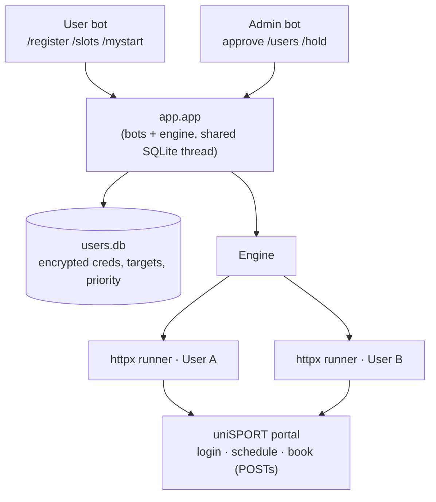

# Uni Trier Sports Bot — Multi-User

You decide to play badminton. Very wholesome. Apparently everyone else on campus
has the same spiritual awakening at the exact same time, so the slot is full
before you finish pretending this was a casual plan.

This bot logs into the Uni Trier uniSPORT portal, watches a chosen
sport/day/time, and books it the instant the real `Buchen` form appears — now
for **many users at once**, each from their own account, coordinated by priority
so your own accounts never fight over a single seat.

## What's new in the multi-user version

- **Many accounts in parallel** — each user is a lightweight HTTP session
  (`httpx`), not a browser. A small VPS handles many users.
- **Pure HTTP, no Playwright** — login, schedule, and booking are plain form
  POSTs. Fast (milliseconds per booking) and cheap on RAM.
- **Admin approval** — users `/register` on the public bot; you approve on a
  separate **admin bot** with one tap.
- **Encrypted credentials** — uni passwords are stored Fernet-encrypted at rest.
- **Credential check at signup** — registration verifies the login before
  storing, so users get instant ✅/❌ feedback.
- **Priority "strike"** — when a slot opens with N free seats, only the top-N
  users by priority book; the rest stand by and cascade in if a seat is left.
- **Queue + hold** — a concurrency cap queues extra users; the admin can
  hold/release anyone if the VPS is loaded.

## Architecture



| Module | Role |
|---|---|
| `app/slots.py` | Parse schedule HTML → `Slot` objects (availability, time, Rest, fields) |
| `app/portal.py` | Per-user `httpx` client: `login`, `list_slots`, `book` |
| `app/db.py` | Encrypted SQLite user store (status, target, priority) |
| `app/bot.py` | Two Telegram bots: user commands + admin approval/management |
| `app/engine.py` | One runner per active user; priority-strike coordination |
| `app/app.py` | Runs bots + engine together |

## Setup

```powershell
cd D:\Projects\uni-sports-bot
python -m venv venv
.\venv\Scripts\pip install -r requirements.txt
```

1. **Create two bots** in [@BotFather](https://t.me/BotFather): a public user bot
   and a private admin bot. Send `/start` to your admin bot so it can message you.
2. **Generate the encryption key:**
   ```powershell
   .\venv\Scripts\python -m app.db genkey
   ```
3. Copy `.env.example` → `.env` and fill in `TELEGRAM_BOT_TOKEN`,
   `ADMIN_BOT_TOKEN`, `ADMIN_USER_ID`, and `USER_DB_KEY`.

## Run

```powershell
.\venv\Scripts\python -m app.app
```

This starts both bots and the booking engine.

## Commands

**User bot:**
```text
/register <uni_email> <password>      request access (verified + admin-approved)
/slots                                browse live slots, pick day → slot
/mytarget Badminton Donnerstag 14:00  set target manually
/mystart                              start auto-booking your target
/mystop                               stop
/mystatus                             your status and target
```

**Admin bot:**
```text
/pending                       list access requests
/approve <id> / /reject <id>   (also inline buttons on each request)
/users                         list everyone with status/target/priority
/hold <id> / /release <id>     park / un-park a user
/priority <id> <n>             lower number = books first
/kick <id>                     remove a user
```

## How booking works

A course card exposes a booking form. The bot books only the real open form
(`kurstermin_sst_buchen.php`, button `Buchen`) and never the waitlist
(`warteliste_buchen.php`). Each user's own session supplies their own
`idkunde`/`mitglied_id`, so parallel accounts don't collide. When a slot opens
with `Rest: N`, the top-N active users (by priority) for that exact slot book
simultaneously; lower-priority users stand by and step in only if a seat remains.

## Deploy (VPS)

```bash
docker compose up -d --build
docker compose logs -f sports-bot
```

The image is browser-free (pure HTTP), so it's small. `users.db` is mounted to
persist registrations. `restart: unless-stopped` brings it back after reboots.

> Only one process may poll a given bot token at a time. If you see HTTP **409
> Conflict**, another instance (old VPS container, a second terminal) is still
> running the same bot — stop it.

## Tests

```powershell
.\venv\Scripts\python -m scripts.phase0_proof       # live: login + list slots
.\venv\Scripts\python -m scripts.test_engine_logic  # offline: priority strike
```

## Safety notes

- Don't commit `.env`, `users.db`, or saved portal HTML (all gitignored).
- The bot automates each user's own portal session — use responsibly and keep
  the polling interval reasonable.
- If a bot token leaks, rotate it in BotFather.
