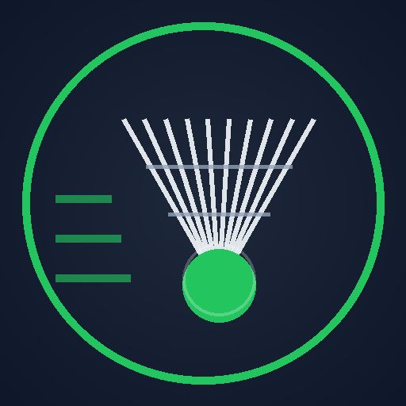
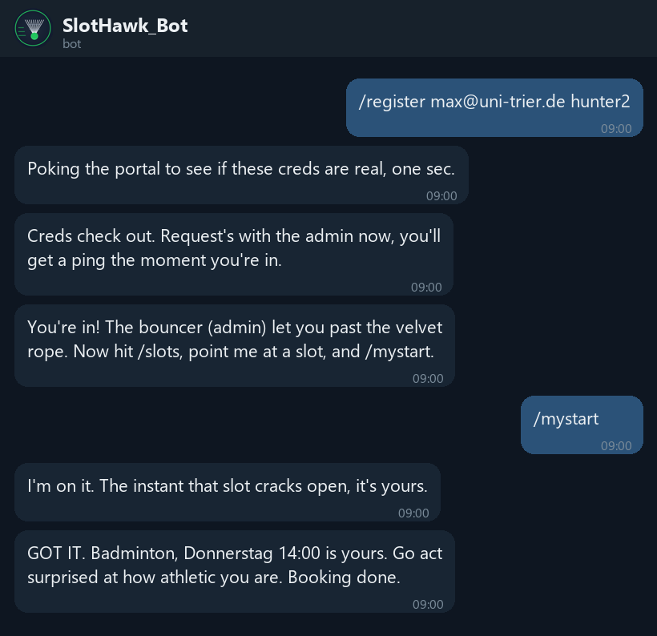
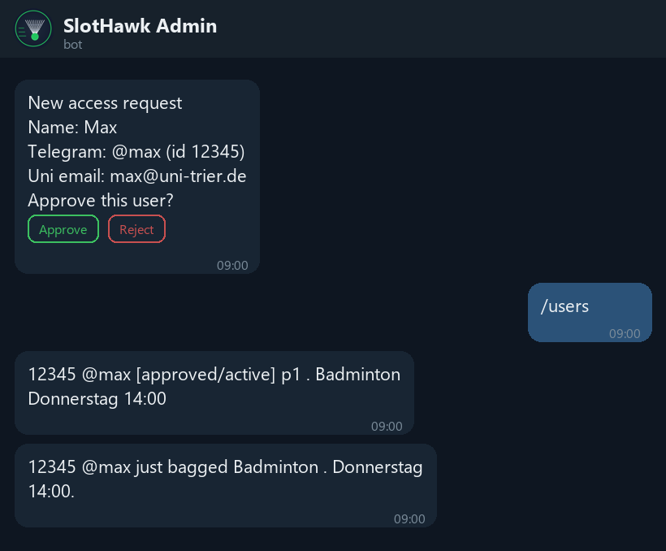
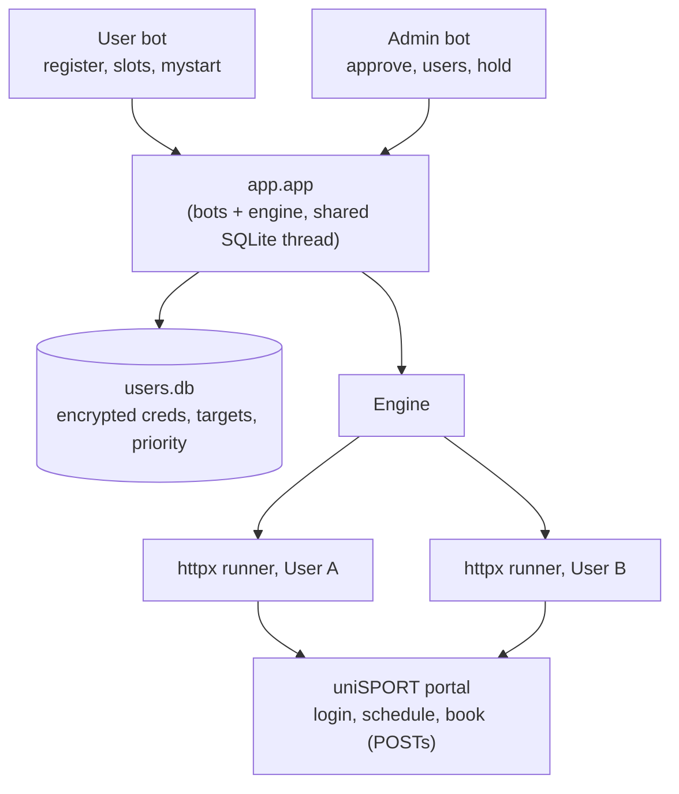

<div align="center">



# SlotHawk &nbsp;·&nbsp; Uni Trier Sports Bot

**Your personal slot-snatching goblin for the Uni Trier uniSPORT portal.**
You sleep, it refreshes the portal like a maniac and books your slot the instant it opens.

</div>

You decide to play badminton. Very wholesome. Apparently everyone else on campus
has the same spiritual awakening at the exact same time, so the slot is full
before you finish pretending this was a casual plan. SlotHawk watches one
sport/day/time per person and grabs it the moment the real `Buchen` button shows
up. Many people can run it at once, each on their own account, coordinated by
priority so your own accounts never fight over the same seat.

## See it in action

<div align="center">

| You, the user | You, the admin |
|:---:|:---:|
|  |  |
| Register, pick a slot, walk away. | Approve people with one tap, watch the wins roll in. |

</div>

## Why this version is different

* **Many accounts in parallel.** Each user is a featherweight HTTP session
  (`httpx`), not a browser. A small VPS handles plenty of them.
* **Pure HTTP, zero browser.** Login, schedule, and booking are plain form
  POSTs, so booking takes milliseconds and the image stays tiny.
* **Admin approval.** People `/register` on the public bot; you approve on a
  separate private admin bot with one tap.
* **Encrypted credentials.** uniSPORT passwords are stored Fernet encrypted,
  visible to nobody, admin included.
* **Live credential check.** Registration verifies the login before storing, so
  users get an instant thumbs up or down.
* **Priority strike.** When a slot opens with N free seats, only the top N users
  by priority book it; everyone else stands by and steps in if a seat survives.
* **Queue and hold.** A concurrency cap queues extra users, and the admin can
  park or release anyone if the VPS gets busy.

## Architecture



| Module | Role |
|:--|:--|
| `app/slots.py` | Parse schedule HTML into structured `Slot` objects |
| `app/portal.py` | Per user `httpx` client: `login`, `list_slots`, `book` |
| `app/db.py` | Encrypted SQLite user store (status, target, priority) |
| `app/bot.py` + `telegram_api.py` | Two bots: public users plus private admin |
| `app/engine.py` | One runner per active user, priority strike coordination |
| `app/app.py` | Runs bots and engine together |

## Setup

```powershell
cd D:\Projects\uni-sports-bot
python -m venv venv
.\venv\Scripts\pip install -r requirements.txt
```

1. Create two bots in [@BotFather](https://t.me/BotFather): a public user bot
   and a private admin bot. Send `/start` to the admin bot so it can message you.
2. Generate the encryption key:
   ```powershell
   .\venv\Scripts\python -m app.db genkey
   ```
3. Copy `.env.example` to `.env` and fill in `TELEGRAM_BOT_TOKEN`,
   `ADMIN_BOT_TOKEN`, `ADMIN_USER_ID`, and `USER_DB_KEY`.

## Run

```powershell
.\venv\Scripts\python -m app.app
```

That starts both bots and the booking engine.

## Commands

**User bot**
```text
/register <uni_email> <password>      request access (verified, then approved)
/slots                                browse live slots, pick day then slot
/mytarget Badminton Donnerstag 14:00  set target manually
/mystart                              start auto booking your target
/mystop                               stop
/mystatus                             your status and target
```

**Admin bot**
```text
/pending                       list access requests
/approve <id>, /reject <id>    also inline buttons on each request
/users                         everyone with status, target, priority
/info <id>                     full detail on one user
/stats                         counts: active, idle, queued, booked
/hold <id>, /release <id>      park or un-park a user
/pauseall, /resumeall          hold or release everyone
/priority <id> <n>             lower number books first
/settarget <id> <sport> <day> <time>   set a user's target for them
/interval <seconds>            polling speed
/broadcast <message>           message all users
/kick <id>                     remove a user
```

## How booking works

A course card exposes a booking form. SlotHawk books only the real open form
(`kurstermin_sst_buchen.php`, button `Buchen`) and never the waitlist
(`warteliste_buchen.php`). Each user's own session supplies their own
`idkunde`/`mitglied_id`, so parallel accounts never collide. When a slot opens
with `Rest: N`, the top N active users by priority for that exact slot strike at
once, and lower priority users step in only if a seat is left.

A note on the portal's 24 hour rule: you cannot hold two advance bookings within
24 hours of each other (same day is fine). SlotHawk warns you up front, still
attempts the booking, and tells you in plain language if the portal blocks it.

## Deploy (VPS)

```bash
docker compose up -d --build      # or: docker-compose up -d --build
docker compose logs -f sports-bot
```

The image is browser free, so it is small. The encrypted `users.db` lives in a
mounted `data/` directory and survives restarts. `restart: unless-stopped`
brings it back after reboots.

> Only one process may poll a given bot token at a time. If you see HTTP **409
> Conflict**, another instance (an old container, a second terminal) is still
> running the same bot. Stop it.

## Tests

```powershell
.\venv\Scripts\python -m scripts.phase0_proof       # live: login + list slots
.\venv\Scripts\python -m scripts.test_engine_logic  # offline: priority strike
```

## Safety notes

* Never commit `.env`, `users.db`, or saved portal HTML. They are gitignored.
* SlotHawk automates each user's own portal session. Use it responsibly and keep
  the polling interval reasonable.
* If a bot token leaks, rotate it in BotFather.
