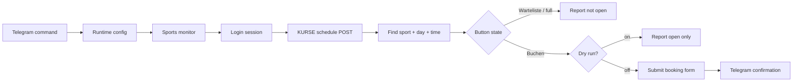
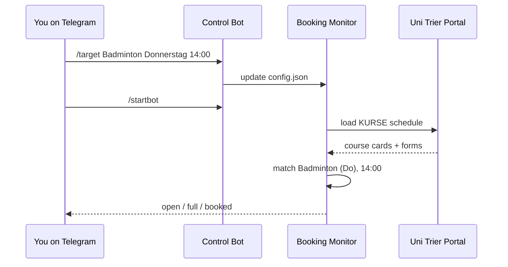

# Uni Trier Sports Bot

You decide to play badminton. Very wholesome. Apparently everyone else on campus has the same spiritual awakening at the exact same time, so the slot is full before you even finish pretending this was a casual plan.

Then you join the waiting list. Maybe an email arrives saying a slot opened. Maybe it arrives late. Maybe by the time you click through, someone else has already been blessed by the booking gods. Luck is still not in anyone's hands, but increasing the probability of being the lucky one is exactly what this bot is here for.

This bot logs into the Uni Trier sports portal, loads the course schedule, watches one configured sport/day/time, and books it when the real `Buchen` form appears.

It also has Telegram control, 
(for the geeks) because opening a VPS just to change `Badminton Donnerstag 14:00` to `Badminton Dienstag 12:00` is the kind of tiny inconvenience that somehow becomes your entire evening.

## What It Does

- Logs into the Uni Trier uniSPORT account page.
- Opens the KURSE schedule directly with the portal POST state.
- Finds the target course card by sport, weekday, and time.
- Reports whether the slot is open, full, or on `Warteliste`.
- Submits the actual booking form when `DRY_RUN=false`.
- Lets you control target, pause/resume, dry-run, interval, and status from Telegram.
- Runs locally or on a VPS with Docker Compose.

## How It Flows





## Current Booking Logic

The portal exposes booking through forms such as:

```html
<form method="POST" target="frame" action="kurstermin_sst_buchen.php">
  <input name="sub" value="Buchen" type="submit">
  <input name="kurs_id" value="15701494" type="hidden">
  <input name="mitglied_id" value="13381" type="hidden">
  <input name="idkunde" value="13381" type="hidden">
  <input name="spring" value="3" type="hidden">
  <input name="id_kurs" value="2009" type="hidden">
  <input name="mobile" value="0" type="hidden">
  <input name="sperre24" value="0" type="hidden">
</form>
```

The bot checks for that exact `kurstermin_sst_buchen.php` form and `Buchen` submit button. If the target card only has `warteliste_buchen.php` or `Warteliste`, it does not book.

## Setup

```powershell
cd D:\Projects\uni-sports-bot
uv sync
uv run playwright install chromium
```

Create `.env` from `.env.example` and fill in:

```env
LOGIN_URL=https://ahs.uni-trier.de/login_neu.php
TARGET_URL=https://ahs.uni-trier.de/index_account.php

UNI_USERNAME=your-email
PASSWORD=your-password

SPORT=Badminton
DAY=Donnerstag
TIME_SLOT=14:00

DRY_RUN=true
POLL_INTERVAL_SECONDS=3
POLL_JITTER_SECONDS=0
```

Keep `DRY_RUN=true` until `/check` and the logs clearly point to the correct slot.

## Run Locally

```powershell
uv run python -m app.main
```

The app starts the Telegram listener and the monitor loop. By default runtime config starts paused, so use Telegram to resume checks:

```text
/startbot
```

## Telegram Control

Set these in `.env`:

```env
TELEGRAM_BOT_TOKEN=your_botfather_token
TELEGRAM_ALLOWED_USER_ID=your_numeric_telegram_user_id
```

Then open the bot in Telegram and send:

```text
/start
```

The bot registers its command menu automatically, so typing `/` in Telegram shows available commands.

### Commands

```text
/status
```

Shows current target, pause state, dry-run mode, and polling interval.

```text
/check
```

Loads the portal once and reports current availability for the configured target.

```text
/target Badminton Donnerstag 14:00
```

Sets sport, day, and time in one command.

```text
/set sport Badminton
/set day Donnerstag
/set time 14:00
```

Changes one target field at a time.

```text
/startbot
/stopbot
```

Starts or pauses continuous checking. Paused means the Python process is still alive and Telegram still works, but booking checks are not running.

```text
/dryrun on
/dryrun off
```

`on` means detect and report only. `off` allows real booking submission.

```text
/interval 3
```

Checks every 3 seconds. Lower is more aggressive; also more annoying to the portal, so use judgment.

## Can Telegram Start A Stopped App?

No. Telegram can only talk to code that is already running. The sane setup is:

- Keep the app/container running on the VPS.
- Keep booking checks paused with `/stopbot` when you do not need them.
- Use `/startbot` when you want the bot to actively monitor.

If the VPS process or Docker container is stopped, Telegram cannot magically resurrect it. That would require a separate always-on supervisor, and at that point we have invented a tiny operations department. No thanks.

## Docker

Build and run:

```powershell
docker compose up -d --build
docker compose logs -f sports-bot
```

Docker Compose mounts:

```text
./config      -> runtime Telegram-controlled config
```

For a VPS, set:

```env
HEADLESS=true
```

The container uses `restart: unless-stopped`, so it comes back after reboots unless you explicitly stop it.

## Safety Notes

- Keep `DRY_RUN=true` while testing.
- Use `/check` before `/dryrun off`.
- Do not commit `.env` or `config.json`.
- If you accidentally paste your Telegram token somewhere public, rotate it in BotFather.
- This bot automates your own portal session. Use it responsibly and do not hammer the service.

## Status Examples

Open slot:

```text
Badminton (Do)
Day: Donnerstag, 28.05.
Time: 14:00 - 15:30 Uhr
Status: open
Button: Buchen
Action: kurstermin_sst_buchen.php
Rest: 13
```

Full slot:

```text
Badminton (Di)
Day: Dienstag, 26.05.
Time: 12:00 - 13:30 Uhr
Status: not open
Button: Warteliste
Action: warteliste_buchen.php
Rest: 0
```
